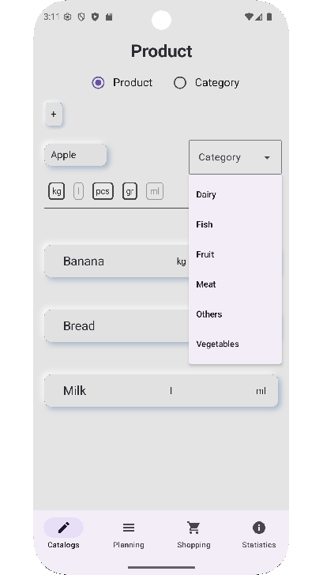
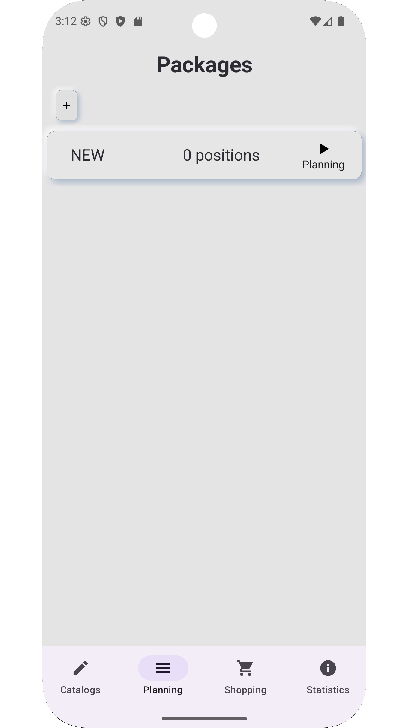
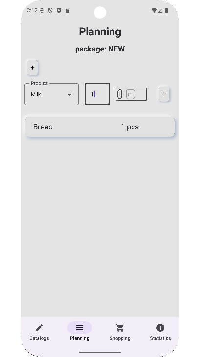
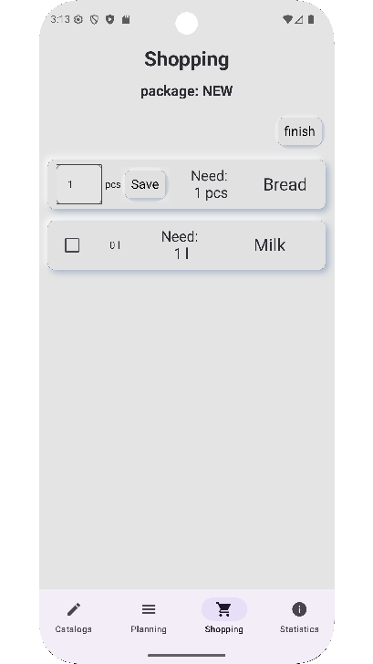

# 🛒 ShoppingPlanner

**ShoppingPlanner** is an Android application built with **Kotlin** and **Jetpack Compose** that helps you plan, organize, and track your shopping lists.  
The app allows you to create catalogs of products, plan purchases in advance, and mark items as bought while shopping.

## ✨ Features

- 📦 **Product Catalog** — Add products with names, categories, and measurement units.
- 📅 **Shopping Plans** — Create shopping packages with planned quantities for each product.
- 🛍 **Buying Mode** — Check off purchased items directly in the store.
- 📊 **Statistics** — View purchased products by month.
- 🖌 **Modern UI** — Built with **Jetpack Compose** for a smooth and responsive experience.
- 💾 **Offline Support** — All data is stored locally using **Room Database**.

## 📱 Screenshots

&nbsp;&nbsp;&nbsp;&nbsp;&nbsp;&nbsp;&nbsp;&nbsp;&nbsp;&nbsp;&nbsp;&nbsp;&nbsp;&nbsp;&nbsp;&nbsp;&nbsp;&nbsp;&nbsp;&nbsp;&nbsp;&nbsp;&nbsp;&nbsp;

## 🛠 Tech Stack

- **Language:** Kotlin
- **UI:** Jetpack Compose
- **Architecture:** MVVM
- **Database:** Room
- **Navigation:** Jetpack Navigation
- **Build Tools:** Gradle
- **Other:** ViewModel, StateFlow, Coroutines

## 📁 Project Structure

app/  
  ├── dao/ &nbsp;&nbsp; &nbsp;&nbsp;&nbsp;&nbsp;&nbsp;&nbsp;&nbsp;&nbsp;&nbsp;&nbsp;&nbsp;&nbsp;&nbsp;&nbsp;&nbsp; # Data Access Objects<br>
  ├── data/ &nbsp;&nbsp; &nbsp;&nbsp;&nbsp;&nbsp;&nbsp;&nbsp;&nbsp;&nbsp;&nbsp;&nbsp;&nbsp;&nbsp;&nbsp;&nbsp; # Database, repositories<br>
  ├── entity/ &nbsp;&nbsp;&nbsp;&nbsp;&nbsp;&nbsp;&nbsp;&nbsp;&nbsp;&nbsp;&nbsp;&nbsp;&nbsp;&nbsp;&nbsp; # Room entities<br>
  ├── navigation/ &nbsp;&nbsp;&nbsp;&nbsp;&nbsp;&nbsp;&nbsp; # Objects for navigation<br>
  ├── screen/ &nbsp;&nbsp;&nbsp;&nbsp;&nbsp;&nbsp;&nbsp;&nbsp;&nbsp;&nbsp;&nbsp;&nbsp;&nbsp; # Jetpack compose objects for describing screens<br>
  ├── util/ &nbsp;&nbsp;&nbsp;&nbsp;&nbsp;&nbsp;&nbsp;&nbsp;&nbsp;&nbsp;&nbsp;&nbsp;&nbsp;&nbsp;&nbsp;&nbsp;&nbsp;&nbsp;&nbsp; # Utility classes and helpers<br>
  └── info/ &nbsp; &nbsp;&nbsp;&nbsp;&nbsp;&nbsp;&nbsp;&nbsp;&nbsp;&nbsp;&nbsp;&nbsp;&nbsp;&nbsp;&nbsp;&nbsp;&nbsp; # Display models (DTOs)<br>

## Google Play Status

## Privacy Policy

This application respects your privacy. You can read the full privacy policy here:

👉 [Privacy Policy](https://maksimtest.github.io/plan_and_buy_app/privacy-policy.html)

## 🚀 Installation

Clone the repository and open it in **Android Studio**:

```bash
git clone https://github.com/maksimtest/plan_and_buy_app.git
